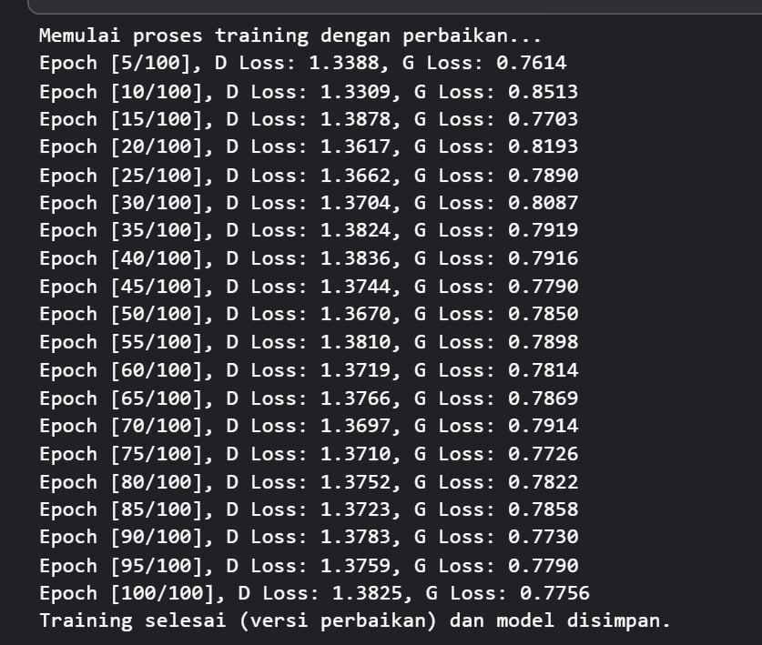

# Implementasi Generative Adversarial Network (GAN)
Proyek ini merupakan implementasi Generative Adversarial Network (GAN) sederhana menggunakan PyTorch.
Tujuan dari proyek ini adalah mempelajari cara kerja GAN dalam menghasilkan gambar baru dari dataset MNIST, serta memvisualisasikan proses pelatihan melalui grafik loss dan contoh gambar yang dihasilkan Generator.

# Struktur Project
GAN-Project: 
- data/FashionMNIST/raw          # Folder untuk menyimpan hasil gambar dari Generator
- generated-images               # Folder untuk menyimpan model yang sudah dilatih
- README.md                      # Dokumentasi project
- discriminator_fixed.pth        # Notebook utama (kode GAN + visualisasi)
- ganerator_fixed.ipynb          # Daftar library yang dibutuhkan

# Clone repository
git clone https:[//github.com/username/GAN-Project.git](https://github.com/zahrasyi/GAN_ML.git)
cd GAN-Project

Install dependency
- Dengan pip
pip install torch torchvision matplotlib
- Dengan conda
conda install pytorch torchvision torchaudio cpuonly -c pytorch

# Menjalankan Project

Buka file notebook  
train_gan.ipynb  
di Jupyter Notebook atau VS Code (dengan Jupyter extension).  
Jalankan cell secara berurutan:  
`1.` Setup & Import Library    
`2.` Persiapan Dataset (MNIST)    
`3.` Definisi Arsitektur Generator & Discriminator  
`4.` Loop Training GAN  
`5.` Visualisasi Loss  
`6.` Hasil Gambar Generator  

# Visualisasi

Selama proses training, model mencatat perkembangan nilai loss Generator (G) dan Discriminator (D) dari epoch 1 hingga epoch 100.

