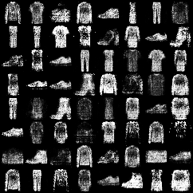
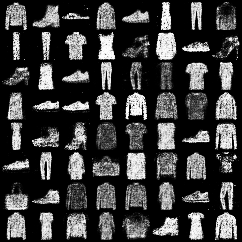

# Implementasi Generative Adversarial Network (GAN)- kelompok 1
Proyek ini merupakan implementasi Generative Adversarial Network (GAN) sederhana menggunakan PyTorch.
Tujuan dari proyek ini adalah mempelajari cara kerja GAN dalam menghasilkan gambar baru dari dataset MNIST, serta memvisualisasikan proses pelatihan melalui grafik loss dan contoh gambar yang dihasilkan Generator.

# Struktur Project
GAN_kelompok1: 
- data/FashionMNIST/raw  ----Folder untuk menyimpan hasil gambar dari Generator
- generated-images       ----Folder untuk menyimpan model yang sudah dilatih
- README.md              ----Dokumentasi project
- discriminator_fixed.pth        
- ganerator_fixed.pth            
- gan_kelompok1.ipynb           ----notebook utama (kode GAN + visualisasi)
- kurva.jpg              ----visualisasi kurva
- running_epoch.jpg      ----visualisasi hasil per-epoch nya

# Clone repository
git clone https:[https://github.com/zahrasyi/GAN_ML.git]
cd GAN_kelompok1

Install dependency
- Dengan pip

[ `pip install torch torchvision matplotlib` ]

- Dengan conda

[ `conda install pytorch torchvision torchaudio cpuonly -c pytorch` ]

# Menjalankan Project

Buka file notebook  
GAN_kelompok1.ipynb  
di Jupyter Notebook atau VS Code (dengan Jupyter extension).  
Jalankan cell secara berurutan:  
`1.` Setup & Import Library    
`2.` Persiapan Dataset (MNIST)    
`3.` Definisi Arsitektur Generator & Discriminator  
`4.` Loop Training GAN  
`5.` Visualisasi Loss  
`6.` Hasil Gambar Generator  

# Visualisasi

Selama proses training, model mencatat perkembangan nilai loss Generator (G) dan Discriminator (D) dari epoch 1 hingga epoch 100.

**Running Epoch (Output Training Log)**

Dari hasil running, terlihat bahwa:
- Discriminator Loss (D Loss) relatif stabil di kisaran 1.33 – 1.38.
- Generator Loss (G Loss) bergerak di kisaran 0.75 – 0.85 dengan sedikit fluktuasi.
- Perubahan nilai loss ini menunjukkan adanya kompetisi yang seimbang: Discriminator tetap cukup kuat membedakan data asli dan palsu, sementara Generator berangsur-angsur meningkatkan kualitas gambar yang dihasilkan.

Selain melihat hasil gambar, proyek ini juga memvisualisasikan perubahan nilai loss dari Generator dan Discriminator sepanjang proses training (epoch 1 sampai 100).

Epoch awal (1–20) → Loss cenderung fluktuatif karena model masih beradaptasi. Generator berusaha menghasilkan gambar yang masuk akal, sementara Discriminator masih mudah membedakan gambar asli dan palsu.

Epoch menengah (20–60) → Kurva loss mulai lebih stabil. Generator semakin mampu menghasilkan pola angka, dan Discriminator menghadapi tantangan lebih besar untuk membedakan data asli dengan hasil Generator.

Epoch lanjut (60–100) → Nilai loss Generator dan Discriminator relatif seimbang. Pada tahap ini, Generator sudah cukup terlatih untuk menghasilkan gambar menyerupai angka MNIST, sementara Discriminator masih berusaha membedakan, sehingga terjadi kompetisi yang sehat.

**Kurva Loss (Generator vs Discriminator)**

Selama proses training, perubahan nilai loss Generator dan Discriminator divisualisasikan dalam bentuk grafik. Visualisasi ini membantu kita memahami bagaimana kedua model saling berkompetisi dan beradaptasi dari awal hingga akhir epoch.

Pada epoch awal (0–20), Generator Loss sempat meningkat tajam sebelum akhirnya menurun dan stabil. Hal ini wajar karena Generator masih beradaptasi untuk menghasilkan gambar yang menyerupai data asli.

Pada epoch pertengahan (20–60), kurva Generator dan Discriminator cenderung stabil, menandakan proses pelatihan mulai seimbang.

Pada epoch lanjut (60–100), kurva menunjukkan bahwa nilai loss Generator dan Discriminator tetap konsisten tanpa perubahan signifikan, menandakan model sudah mencapai kondisi convergence yang baik.
